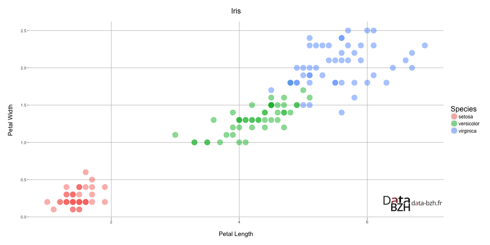

# DataBzhTools

Une collection d'outils (fonctions, constantes) facilitant la rédaction d'articles pour le site [Data-Bzh](http://data-bzh.fr).

## Utilisation

```r
source("DataBzhTools/main.R")

(ggp <- databzhPlot(
  ggplot(data = iris, aes(Petal.Length, Petal.Width, Species)) +
    geom_point(aes(colour = Species), size = 6, alpha = .5) +
    xlab("Petal Length") +
    ylab("Petal Width") +
    ggtitle("Iris") +
    databzh$theme,
  ypos = "bottom"
))

databzhSavePlot(ggp, "demo.png")
```



### Chargement des outils

```r
source("DataBzhTools/main.R")
```

### Fonctions

#### dataBzhPlot

Affichage d'un graphique **ggplot2** avec le logo Data-Bzh.

```r
databzhPlot(ggplot(...))
```

##### Arguments

| Argument | Description | Type / Valeurs |
|----|----|----|
| plot | Objet graphique ggplot2 | ggplot |
| size | Taille du logo à afficher | numeric |
| type | Type de logo | "url.transparent", "url.background", "simple.transparent", "simple.background" |
| xpos | Position horizontale du logo | "left", "right" |
| ypos | Position verticale du logo | "bottom", "top" |

Logos :

| Type | Logo |
|----|----|
| "url.transparent" |  |
| "url.background" |  |
| "simple.transparent" |  |
| "simple.background" |  |

#### databzhSavePlot

Sauvegarde d'un graphique.

```r
databzhSavePlot(plot(...), "image.png")
databzhSavePlot(databzhPlot(ggplot(...)), "image.png")
```

##### Arguments

| Argument | Description | Type / Valeurs |
|----|----|----|
| plot | Objet graphique | |
| filename | Nom du fichier à sauver | character |
| width | Largeur du graphique | integer |
| height | Hauteur du graphique | integer |

### Constantes

L'objet `databzh` contient de multiples constantes.

```r
databzh$theme
databzh$colour
databzh$width
databzh$height
```

| Constante | Description | Valeur |
|----|----|----|
| theme | Thème ggplot2 Data-Bzh | |
| colour | Couleur de thème principale | "#973232" |
| colour1 | Couleur 1 | "#E18C8C" |
| colour2 | Couleur 2 | "#B75353" |
| colour3 | Couleur 3 | "#711515" |
| colour4 | Couleur 4 | "#490101" |
| colours | Couleurs | c("#973232", "#E18C8C", "#B75353", "#711515", "#490101") |
| width | Largeur de sauvegarde des images | 1200 |
| height | Hauteur de sauvegarde des images | 600 |
| logo | Logos, utilisés par la fonction privée `.databzhLogo` | |

